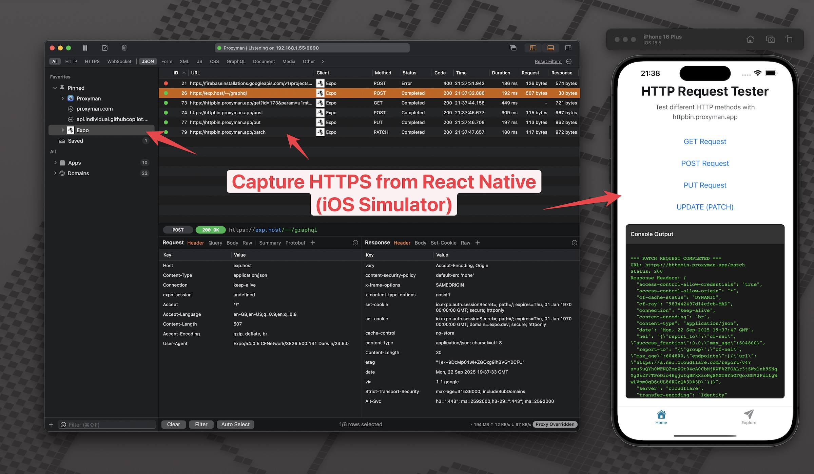
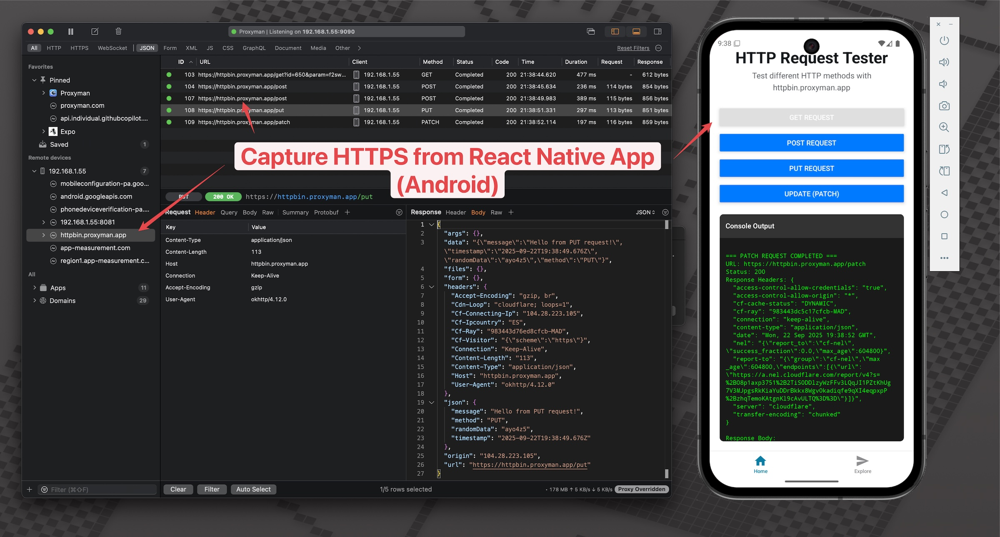

# Capturing HTTPS Traffic from React Native iOS and Android with Proxyman

This sample React Native app demonstrates how to capture HTTPS traffic on both iOS and Android devices using Proxyman.

## Overview

This project shows practical examples of:
- Making HTTPS requests from React Native
- Configuring iOS/Android to work with Proxyman
- Capturing and analyzing network traffic during development



## Getting Started

### Prerequisites
- [Proxyman](https://proxyman.io/) installed on your Mac
- React Native development environment set up
- iOS Simulator or Android Emulator

### Setting up Android Emulator

1. Open Android Studio
2. Go to **Tools** → **AVD Manager**
3. Click **Create Virtual Device**
4. Select **Phone** category and choose **Pixel 9**
5. Click **Next**
6. Select a system image with **Google APIs** (recommended: latest stable version)
7. Click **Next**
8. Name your AVD (e.g., "Pixel_9_API_34")
9. Click **Finish**
10. Start the emulator by clicking the **Play** button

### Installation

1. Install dependencies
   ```bash
   npm install
   ```

2. Run the app on your preferred platform:
   ```bash
   # For iOS
   npm run ios
   
   # For Android
   npm run android
   ```

## Proxyman Setup

### For iOS Simulator
1. Open Proxyman
2. Go to **Certificate** → **Install Certificate on iOS -> Simulator**
3. Follow the setup wizard
4. The app's HTTPS traffic will now be visible in Proxyman


### For Android Emulator
Please refer Setting up Android Emulator section above to know how to create an Android Emulator with Google APIs.

Note: Google Play Store version is not supported yet.

1. Open Proxyman
2. Go to **Certificate** → **Install Certificate on Android -> Emulator**
3. Follow the setup wizard
4. Restart your Android Emulator
5. The app's HTTPS traffic will now be visible in Proxyman



### For Physical Devices
1. Configure your device to use your Mac as HTTP proxy
2. Install Proxyman's certificate on your device
3. Trust the certificate in device settings

## Sample Network Requests

The app includes examples of:
- GET requests to public APIs
- POST requests with JSON data
- Requests with custom headers
- Error handling scenarios

## Blog Post

This code accompanies the Proxyman blog post: "How to Capture HTTPS Traffic from React Native iOS and Android"

## Resources

- [Proxyman Documentation](https://docs.proxyman.io/)
- [React Native Network Guide](https://reactnative.dev/docs/network)
- [Expo Development](https://docs.expo.dev/)
